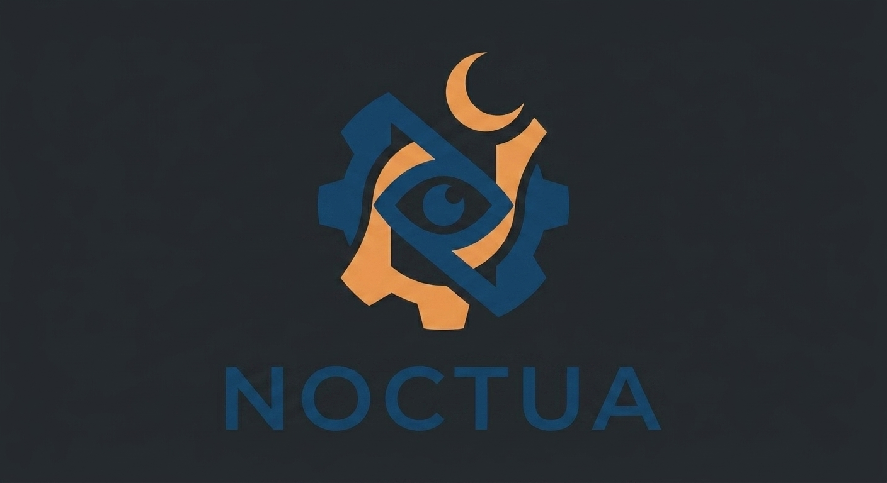

# Noctua

> *"An AI that never sleeps."*

A proactive, multi-domain artifact factory: queue a goal before bed, wake up to a reviewable artifact. Code PRs, reusable tools, social posts, clinical analyses, mechanic diagnostics — same orchestration spine, different producers.



**Hacker:** Hugo Jimenez ([@hugoduar](https://github.com/hugoduar)) — Platanus Build Night Ciudad de México.

---

## What Noctua does

You give Noctua a **Mission** — a goal plus optional inputs and success criteria. While you sleep:

1. A **Planner** (Claude) emits a step graph.
2. A **Docker sandbox** boots — isolated, capped, ephemeral.
3. A **Producer** (domain plugin) drives the work: edits code, runs tests, queries data, generates a post.
4. If a needed **Tool** doesn't exist, Noctua **fabricates** one in a nested sandbox, validates it, persists it for next time.
5. The output lands as an **Artifact** in your morning **Review Queue** — approve, reject, or graduate (for tools).

Hard caps on tokens, wall-clock, and tool calls keep cost bounded. Every artifact is reproducible from its mission spec.

## Hackathon MVP

One vertical end-to-end:

- **CLI:** `noctua run <github-issue-url>` fires a mission.
- **Sandbox:** Docker container per mission (single-host).
- **Producer:** PR builder — clones repo, drives a code-edit + test-run loop, opens a draft PR via `gh`.
- **Tool fabrication:** hardcoded template fabricates a `seed_db` script when the planner needs one; fabricated tools persist and can be **graduated** to the reusable Tool Library via the Review UI.
- **Review UI:** one Next.js page with tabs per producer kind. Approve → `gh pr ready`.
- **Stub producers** (social post, clinical analysis, diagnostic) appear as tabs with canned artifacts so the multi-domain thesis is visible from minute one.

## Stack

| Layer | Choice |
|---|---|
| Control plane | Django Ninja + Postgres |
| Worker | Celery + Redis |
| Sandbox | Docker SDK for Python |
| LLM | Anthropic SDK (Sonnet 4.6 planner, Opus 4.7 code edits & fabrication, prompt caching enabled) |
| Review UI | Next.js + Tailwind |
| Git ops | `gh` CLI shelled out |

## Repo layout

```
.
├── build-night-project.json     # judging metadata
├── project-logo.png
├── docs/
│   ├── planning/
│   │   ├── PRD.md               # full product vision
│   │   └── HACKATHON_MVP.md     # scoped MVP + build order
│   └── superpowers/
│       └── specs/
│           └── 2026-05-29-noctua-mvp-design.md   # design spec (the buildable thing)
└── (code lands here next)
```

## Read first

- **[Design spec](./docs/superpowers/specs/2026-05-29-noctua-mvp-design.md)** — the source of truth for what we're building this weekend.
- **[PRD](./docs/planning/PRD.md)** — full vision, principles, all four personas, post-hackathon north star.
- **[Hackathon MVP scope](./docs/planning/HACKATHON_MVP.md)** — feature list, build order, demo script.

## What this is *not*

Not Devin/Cursor (those amplify the workday — Noctua extends it overnight). Not n8n/Zapier (deterministic). Not AutoGPT (no reviewable artifact). Not a CI system (CI validates code humans wrote; Noctua writes the code *and* validates it).

---

## ⚠️ Deploying (Vercel, Render, etc.)

Deploy platforms can't connect to org repos. Mirror to a personal repo:

1. Create a **personal** repo on your own GitHub account.
2. Point local `origin` at both:

   ```bash
   git remote set-url --add --push origin https://github.com/platanus-build-night/platanus-build-night-26-mx-hugoduar.git
   git remote set-url --add --push origin https://github.com/<your-user>/<your-repo>.git
   ```

3. Connect your deploy service to the personal repo.
